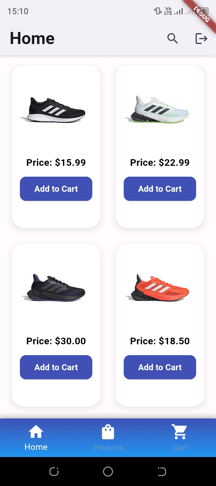
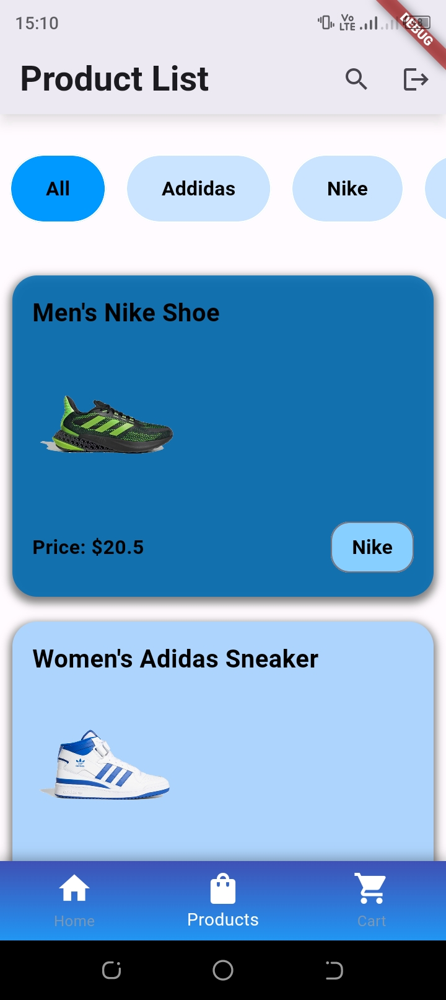
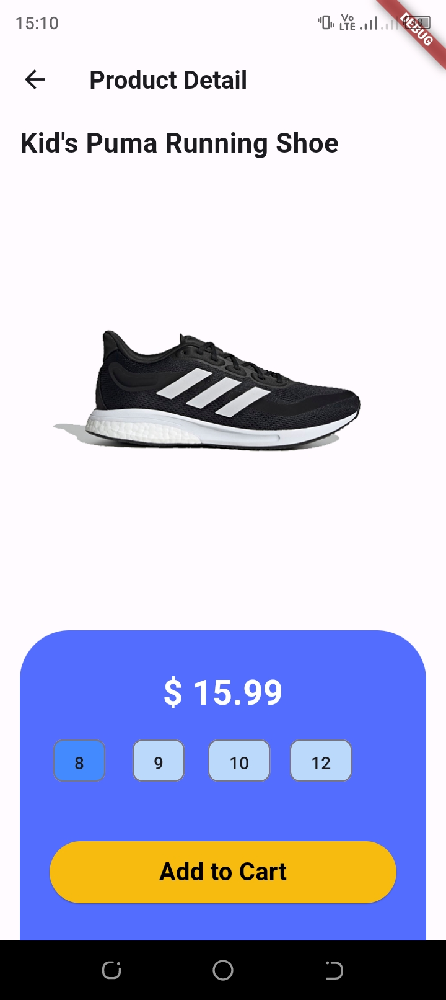
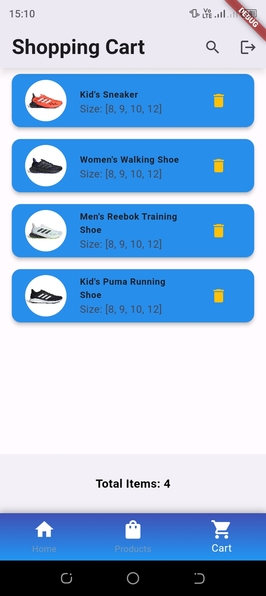
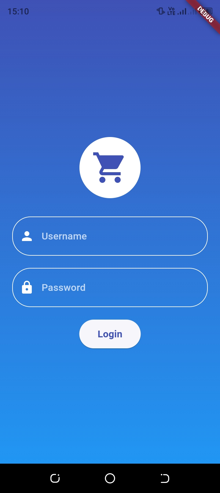
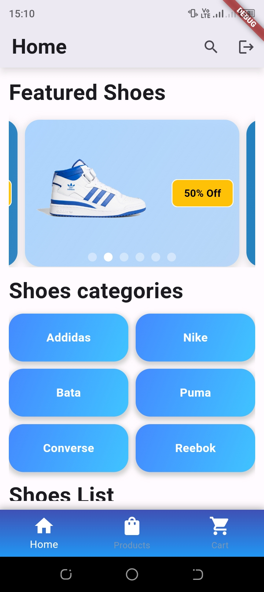
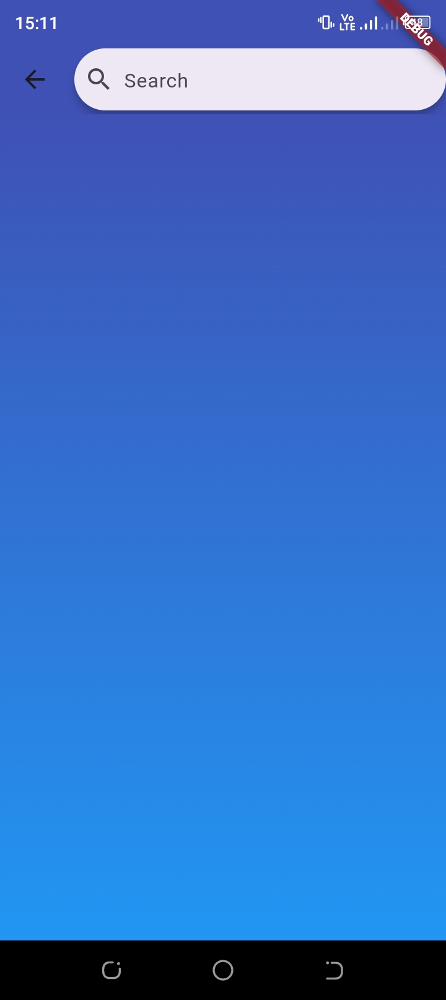

# My Shop

A Flutter project for a shopping app.

## Table of Contents

- [Introduction](#introduction)
- [Project Structure](#project-structure)
- [Getting Started](#getting-started)
- [Features](#features)
- [Screenshots](#screenshots)
- [Dependencies](#dependencies)
- [Contributing](#contributing)
- [License](#license)

## Introduction

This Flutter project, "My Shop," is a simple shopping app with features such as product browsing, detailed product information, and a shopping cart.

## Project Structure

- **lib/main.dart**: The main entry point for the application.
- **lib/cart_provider.dart**: Provider class for managing the shopping cart state.
- **lib/login_page.dart**: Login page UI and logic.
- **lib/logout.dart**: Logout page UI.
- **lib/mainpage.dart**: Main page with a bottom navigation bar.
- **lib/product_card.dart**: Widget for displaying individual product cards.
- **lib/product_data.dart**: Dummy product data.
- **lib/product_detail.dart**: Page displaying detailed product information.
- **lib/product_item.dart**: Widget for individual product items.
- **lib/product_list.dart**: Page for displaying a list of products.
- **lib/search_page.dart**: Search page UI.
- **lib/welcoming_page.dart**: Welcoming page UI.

## Getting Started

1. Clone the repository:

    ```bash
    git clone https://github.com/hammadasifali/Flutter_shop.git
    ```

2. Open the project in Visual Studio Code or your preferred IDE.

3. Run the project using the following command:

    ```bash
    flutter run
    ```

## Features

- **Product List:** Browse a list of products with filters.
- **Product Details:** View detailed information about each product.
- **Shopping Cart:** Add products to the cart and view the total price.
- **Login and Logout:** Simple login functionality with a logout option.

## Screenshots

<table>
  <tr>
    <td align="center">
      <b>Splash Screen</b><br>
      
    </td>
    <td align="center">
      <b>Product List</b><br>
      
    </td>
    <td align="center">
      <b>Product Details</b><br>
      
    </td>
  </tr>
  <tr>
    <td align="center">
      <b>Shopping Cart</b><br>
      
    </td>
    <td align="center">
      <b>Login Page</b><br>
      
    </td>
    <td align="center">
      <b>Logout Page</b><br>
      
    </td>
  </tr>
  <tr>
    <td align="center">
      <b>Main Page</b><br>
      
    </td>
    <td align="center">
      <b>Main Page 2</b><br>
      
    </td>
    <td align="center">
      <b>Search Page</b><br>
      
    </td>
  </tr>
</table>


## Dependencies

- **provider:** State management library for managing the shopping cart state.
- **flutter_animate:** Animation library for adding animated effects.
- **flutter_svg:** SVG rendering library for displaying SVG images.

Check the `pubspec.yaml` file for the complete list of dependencies.

## Contributing

Feel free to contribute to the project by opening issues or submitting pull requests.

## License

This project is licensed under the [MIT License](LICENSE).
#
